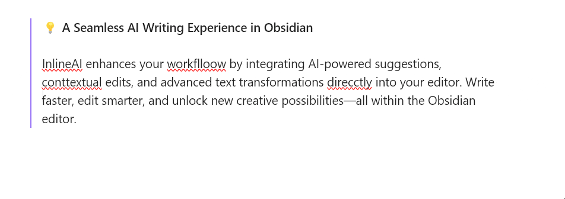

<h1 align="center">InlineAI Plugin</h1>

<p align="center">
  <a href="https://github.com/FBarrca/obsidian-inlineai/wiki">Documentation</a>
  ·
  <a href="https://github.com/FBarrca/obsidian-inlineai/issues">Report Bug</a>
  ·
  <a href="https://github.com/FBarrca/obsidian-inlineai/discussions">Discussions</a>
</p>



---

> **💡 A Seamless AI Writing Experience in Obsidian**
>
> InlineAI enhances your workflow by integrating AI-powered suggestions, contextual edits, and advanced text transformations directly into your editor. Write faster, edit smarter, and unlock new creative possibilities—all within the Obsidian editor.

---

## 🌟 Features

### **1. Context-Aware AI Assistance**

- Transform text, summarize, or rewrite content using prompts tailored to your needs.
- Define your own **system and transformation prompts** as commands for highly customized workflows.

### **2. Inline Diff Visualization**

- Visualize AI-suggested changes with clear inline markers for added and removed text.
- Accept or discard suggestions with a single click.

### **3. Full AI Integration**

- Supports **OpenAI**, **Ollama**,**Gemini** and other APIs.
- Local model support for privacy-first workflows.

---

## ⚙️ Installation

### **1. From Obsidian Plugin Store**

1. Open Obsidian Settings.
2. Navigate to **Community Plugins** → **Browse**.
3. Search for "InlineAI" and click **Install**.
4. Enable the plugin in the Installed Plugins list.

### **2. Manual Installation**

1. Download the latest release from the [GitHub Releases](https://github.com/FBarrca/obsidian-inlineai/releases).
2. Copy `main.js`, `styles.css`, and `manifest.json` into your vault's `.obsidian/plugins/obsidian-inlineai/` directory.
3. Enable the plugin via the Community Plugins tab.

---

## 🚀 Getting Started

### Initial Setup

1. **Set up your API key**:

   - Open the plugin settings in Obsidian.
   - Enter your API key for OpenAI, Ollama, Gemini or any supported model provider.
2. **Choose a model**:

   - Supported models include `gpt-4`, `llama3.2`, and others.
3. **Configure prompts**:

   - Define system and transformation prompts in settings for customized interactions.

### How to Use

- **Trigger AI Tooltips**: Highlight text or place the cursor, then press `Ctrl + K` / `Cmd + K` to activate the tooltip(you can change the hotkey).
- **Apply Edits**: Use the inline diff view to accept or discard AI-suggested changes.

---

## 🙏 Feedback and Support

We value your feedback and aim to make InlineAI the ultimate AI writing assistant:

- **Bug Reports**: Submit issues on our [GitHub Issues](https://github.com/FBarrca/obsidian-inlineai/issues) page.
- **Feature Requests**: Share ideas in the [Discussions](https://github.com/FBarrca/obsidian-inlineai/discussions) forum.
- **Show Your Workflow**: Showcase your use cases in our [Community Showcase](https://github.com/FBarrca/obsidian-inlineai/discussions/categories/showcase).

---

## 🛠️ Development

Want to contribute? Here’s how:

1. Clone the repository:

    ```bash

    git clone https://github.com/FBarrca/obsidian-inlineai.git

    ```
2. Install dependencies:

    ```bash

    npm install

    ```
3. Build the plugin:

    ```bash

    npm run build

    ```

---

## 📝 License

This project is licensed under the [GPL-3.0 license](LICENSE). Feel free to fork, contribute, and enhance the plugin!
